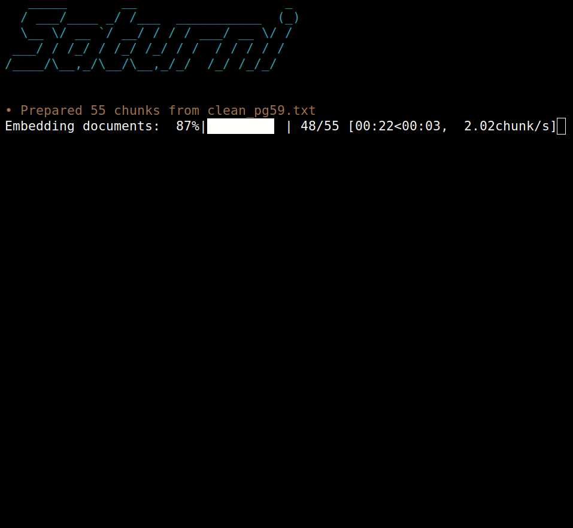
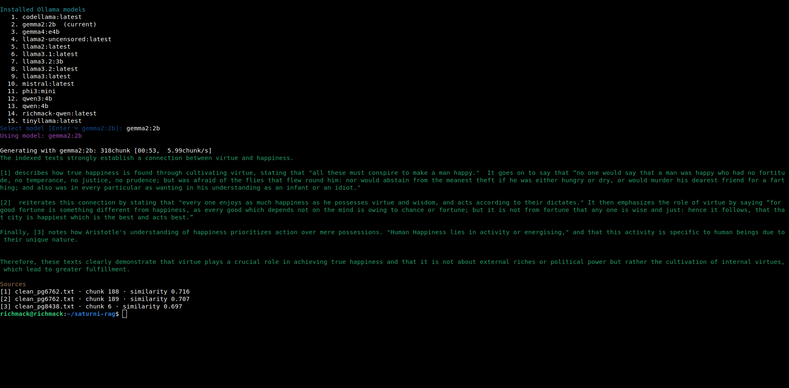
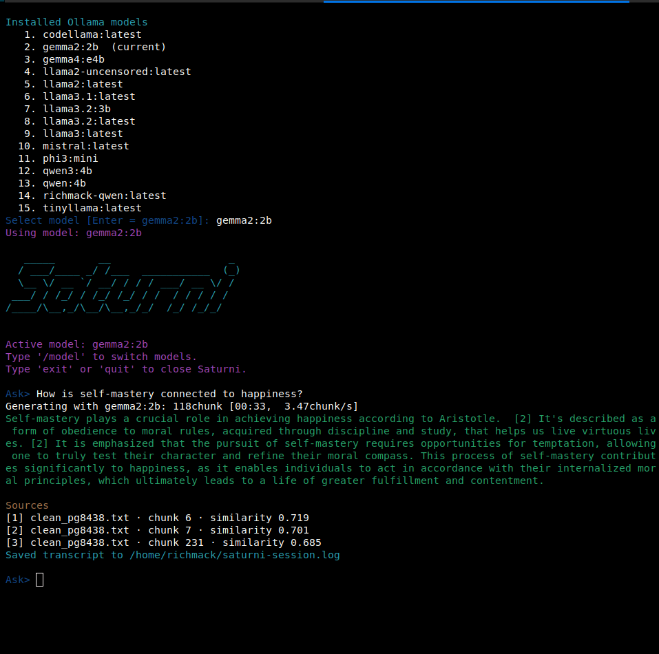

# Saturni RAG

[](CHANGELOG.md)
[](https://www.python.org/)
[](https://github.com/iamrichmack111/saturni-rag/actions/workflows/ci.yml)
[](LICENSE)

**Saturni RAG** is a local-first retrieval-augmented generation system for searching and analyzing books, notes, research, and other plain-text collections. It combines Ollama embeddings and local language models with a FAISS vector index, keeping document processing, retrieval, and generation on infrastructure you control.

## Feature demonstrations

### Batched indexing with a live progress bar

Run the following command from the repository directory. The separate data directory makes it safe to use as a screenshot demonstration without replacing the main index.

```bash
cd "$HOME/saturni-rag"
rm -rf "$HOME/.cache/saturni-progress-demo"

saturni index \
  --force \
  --data-dir "$HOME/.cache/saturni-progress-demo" \
  clean_pg59.txt
```



Saturni reports the number of prepared chunks, embedding percentage, elapsed time, estimated time remaining, and processing speed.

### Interactive Ollama model selection and grounded answers

Use `--choose-model` to select any installed Ollama generation model before asking a one-shot question:

```bash
saturni ask \
  --choose-model \
  --show-sources \
  "What relationship do the indexed texts establish between virtue and happiness?"
```



The result includes the selected model, generation activity, numbered citations, source files, chunk numbers, and similarity scores.

### Interactive REPL with model switching and transcript logging

Start a persistent research session with an interactive model chooser:

```bash
saturni repl \
  --choose-model \
  --show-sources \
  -o "$HOME/saturni-session.log"
```

At the `Ask>` prompt, enter:

```text
How is self-mastery connected to happiness?
```

Use `/model` at any time to select another installed Ollama model. Use `exit` or `quit` to close Saturni.



## Why Saturni

Saturni demonstrates a complete local RAG pipeline rather than a basic chatbot wrapper:

- Discovers individual text files or recursively scans directories.
- Splits documents into overlapping chunks to preserve context.
- Creates batched embeddings with Ollama and `nomic-embed-text`.
- Displays live `tqdm` progress while embedding documents.
- Normalizes vectors for cosine-similarity retrieval in FAISS.
- Retrieves the most relevant passages for each question.
- Generates grounded answers with numbered source references.
- Lets users select from locally installed Ollama models.
- Supports model switching from inside the interactive REPL.
- Displays generation activity, elapsed time, and output speed.
- Saves one-shot and interactive research transcripts.
- Detects unchanged documents with SHA-256 hashes during incremental updates.
- Stores portable JSON metadata and performs atomic index writes.
- Includes an installer, uninstaller, diagnostics, tests, linting, builds, and CI.

## Architecture

```text
Plain-text documents
        │
        ▼
Overlapping word chunks
        │
        ▼
Ollama embedding model
        │
        ▼
Normalized vectors ───────────────► FAISS index
                                        │
Question ─► query embedding ─► top-k retrieval
                                        │
                                        ▼
                            Retrieved source passages
                                        │
                                        ▼
                           Selected Ollama language model
                                        │
                                        ▼
                 Grounded answer + citations + source scores
```

## Requirements

- Linux or macOS
- Python 3.10 or newer
- Ollama installed and running
- Enough storage for the selected Ollama models and generated vector index

Start Ollama before indexing or asking questions:

```bash
ollama serve
```

## Installation

Clone the repository and run the isolated installer:

```bash
git clone https://github.com/iamrichmack111/saturni-rag.git
cd saturni-rag
chmod +x install.sh uninstall.sh
./install.sh --pull-models
```

The installer:

- creates a virtual environment at `~/.local/share/saturni-rag/venv`;
- installs Saturni and its Python dependencies;
- creates `saturni` and `saturni-rag` commands in `~/.local/bin`;
- optionally pulls `nomic-embed-text` and `gemma2:2b`;
- does not require `sudo`.

Add the user command directory to the current shell when necessary:

```bash
export PATH="$HOME/.local/bin:$PATH"
hash -r
```

To make the path permanent in Bash:

```bash
echo 'export PATH="$HOME/.local/bin:$PATH"' >> "$HOME/.bashrc"
source "$HOME/.bashrc"
```

Verify the installation:

```bash
saturni --version
saturni doctor
```

A missing vector index is expected before the first indexing run. All other diagnostics should pass.

## Quick start

### 1. Build the main index

Index the philosophy texts included in the repository:

```bash
cd "$HOME/saturni-rag"
saturni index --force clean_pg*.txt
```

Index a separate document directory:

```bash
saturni index --force "$HOME/Documents/philosophy"
```

Saturni defaults to 500-word chunks, 75-word overlap, and embedding batches of 16.

### 2. Check the completed index

```bash
saturni doctor
```

The vector-index diagnostic should now report `PASS`.

### 3. Ask a grounded question

Choose a model interactively:

```bash
saturni ask \
  --choose-model \
  --show-sources \
  "How do the indexed texts describe virtue and self-mastery?"
```

Choose a model directly:

```bash
saturni ask \
  --model gemma2:2b \
  --show-sources \
  "What relationship do the indexed texts establish between virtue and happiness?"
```

### 4. Start an interactive research session

```bash
saturni repl \
  --choose-model \
  --show-sources \
  -o "$HOME/saturni-session.log"
```

REPL controls:

```text
/model     Select another installed Ollama model
exit       Close Saturni
quit       Close Saturni
```

### 5. Add documents incrementally

```bash
saturni add "$HOME/Documents/philosophy/new-book.txt"
```

Unchanged documents are skipped using their SHA-256 hashes.

## Commands

```text
saturni index [PATH ...]   Build or replace a FAISS index
saturni add PATH [...]     Add changed or new documents
saturni ask QUESTION       Ask one grounded question
saturni repl               Open the interactive question loop
saturni pull MODEL         Download an Ollama model
saturni doctor             Check Python, packages, Ollama, and storage
```

Display command-specific options:

```bash
saturni --help
saturni index --help
saturni ask --help
saturni repl --help
```

## Model selection

List models directly through Ollama:

```bash
ollama list
```

Open the interactive selector for a one-shot question:

```bash
saturni ask \
  --choose-model \
  --show-sources \
  "What practices support self-mastery?"
```

Use a model without opening the selector:

```bash
saturni ask \
  --model qwen3:4b \
  --show-sources \
  "Compare the retrieved arguments about virtue."
```

Switch models during a REPL session:

```text
Ask> /model
```

Embedding models such as `nomic-embed-text` are excluded from the generation-model menu.

## Progress reporting

During indexing, Saturni displays determinate progress because the total number of chunks is known:

```text
Embedding documents: 87%|████████▋ | 48/55 [00:22<00:03, 2.02chunk/s]
```

During answer generation, Saturni displays generated chunks, elapsed time, and speed:

```text
Generating with gemma2:2b: 118chunk [00:33, 3.47chunk/s]
```

Generation does not display a percentage because the final response length is not known in advance.

## Useful examples

Retrieve five passages instead of three:

```bash
saturni ask \
  --top-k 5 \
  --show-sources \
  "What themes recur across the collection?"
```

Create smaller chunks with additional overlap:

```bash
saturni index \
  --force \
  --chunk-size 350 \
  --overlap 100 \
  clean_pg*.txt
```

Use a separate index for experiments:

```bash
saturni index \
  --force \
  --data-dir "$HOME/.cache/saturni-experiment" \
  clean_pg59.txt
```

Use a remote Ollama server:

```bash
saturni ask \
  --ollama-url http://192.168.1.50:11434 \
  --show-sources \
  "Summarize the retrieved argument."
```

Save a one-shot transcript:

```bash
saturni ask \
  --show-sources \
  -o "$HOME/saturni-answer.log" \
  "How is discipline connected to freedom?"
```

Display the end of a saved session:

```bash
tail -n 40 "$HOME/saturni-session.log"
```

## Answer-quality tests

Test comparative retrieval:

```bash
saturni ask \
  --choose-model \
  --show-sources \
  "Compare how the retrieved works describe virtue, temptation, and self-control. Identify meaningful differences between the sources."
```

Test a focused question:

```bash
saturni ask \
  --choose-model \
  --show-sources \
  "According to the indexed texts, what practices help a person master temptation?"
```

Test grounding with an unsupported modern topic:

```bash
saturni ask \
  --choose-model \
  --show-sources \
  "What do these authors say about TikTok recommendation algorithms?"
```

A grounded response should acknowledge when the indexed material is insufficient instead of inventing unsupported claims.

## Defaults

| Setting | Default |
|---|---:|
| Embedding model | `nomic-embed-text` |
| Generation model | `gemma2:2b` |
| Chunk size | 500 words |
| Chunk overlap | 75 words |
| Embedding batch size | 16 |
| Retrieved passages | 3 |
| Ollama URL | `http://127.0.0.1:11434` |
| HTTP timeout | 120 seconds |

Every major setting can be overridden from the command line.

## Data and privacy

Generated data is stored outside the Git repository by default:

```text
~/.local/share/saturni-rag/data/books.faiss
~/.local/share/saturni-rag/data/metadata.json
```

Change the location with `SATURNI_HOME`, `XDG_DATA_HOME`, or `--data-dir`.

Saturni sends document chunks and questions only to the Ollama server configured by `--ollama-url` or `OLLAMA_HOST`. With the default local Ollama configuration, the RAG workflow does not require a hosted model API.

## Legacy command compatibility

The original command flags remain available:

```bash
saturni --index
saturni --query "What is Faust about?" --ai gemma2:2b
saturni --repl --ai gemma2:2b -o session.log
```

New projects should use the subcommand interface shown above.

## Troubleshooting

### `FAIL Vector index` in `saturni doctor`

Create the first index and rerun diagnostics:

```bash
cd "$HOME/saturni-rag"
saturni index --force clean_pg*.txt
saturni doctor
```

### Ollama is not reachable

Confirm the service is running:

```bash
ollama serve
```

Then check the API:

```bash
curl http://127.0.0.1:11434/api/tags
```

### A required model is missing

```bash
saturni pull nomic-embed-text
saturni pull gemma2:2b
```

### `saturni: command not found`

```bash
export PATH="$HOME/.local/bin:$PATH"
hash -r
```

Add the export line to `~/.bashrc` or `~/.zshrc` to make it permanent.

### Python 3.10 reports an error for `datetime.UTC`

Saturni supports Python 3.10 by using `timezone.utc`. Confirm the installed source contains the compatible import:

```bash
grep -nE 'datetime|timezone|UTC' \
  "$HOME/saturni-rag/src/saturni_rag/core.py"
```

Then reinstall the current source tree:

```bash
cd "$HOME/saturni-rag"
./install.sh
hash -r
```

## Development

Create an editable development environment:

```bash
python3 -m venv .venv
source .venv/bin/activate
python -m pip install --upgrade pip
python -m pip install -e '.[dev]'
```

Run the quality checks:

```bash
ruff check .
pytest
python -m build
```

GitHub Actions runs linting, tests, and package builds against supported Python versions.

## Project structure

```text
saturni-rag/
├── .github/workflows/     # CI and release automation
├── docs/                  # README screenshots
├── src/saturni_rag/
│   ├── __init__.py        # package version
│   ├── cli.py             # commands, model menu, progress, and REPL
│   └── core.py            # chunking, Ollama, FAISS, and retrieval
├── tests/                 # automated tests
├── install.sh             # isolated user installer
├── uninstall.sh           # data-preserving uninstaller
├── pyproject.toml         # package and tool configuration
├── requirements.txt       # runtime dependencies
├── CHANGELOG.md
├── CONTRIBUTING.md
├── SECURITY.md
└── LICENSE
```

## Uninstall

Remove the application while preserving the generated index:

```bash
~/.local/share/saturni-rag/uninstall.sh
```

Remove the application and indexed data:

```bash
~/.local/share/saturni-rag/uninstall.sh --purge
```

## Security and answer quality

Retrieved documents are untrusted input. Saturni instructs the selected language model to answer from the retrieved passages, but generated answers may still be incomplete or incorrect. Review the displayed sources and similarity scores before relying on an answer for important research or decisions.

Security reports should follow [SECURITY.md](SECURITY.md).

## Author

**Jeremy Franklin**  
GitHub: [@iamrichmack111](https://github.com/iamrichmack111)

## License

Released under the [MIT License](LICENSE).
