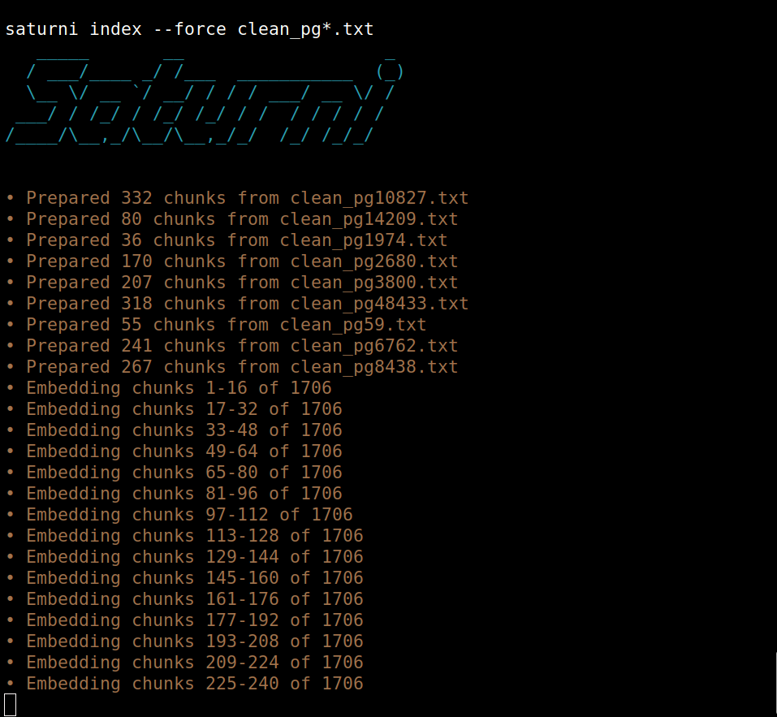

# Saturni RAG

[](CHANGELOG.md)
[](https://www.python.org/)
[](https://github.com/iamrichmack111/saturni-rag/actions/workflows/ci.yml)
[](LICENSE)

**Saturni RAG** is a local-first retrieval-augmented generation system for searching and analyzing books, notes, research, and other plain-text collections. It combines Ollama embeddings and local language models with a FAISS vector index so documents, retrieved passages, and generated answers remain on infrastructure you control.



The example above prepares **1,706 overlapping chunks from nine philosophy texts** and embeds them in batches through Ollama.

## Why Saturni

Saturni demonstrates a complete local RAG pipeline rather than a basic chatbot wrapper:

- Discovers individual text files or recursively scans directories.
- Splits documents into overlapping chunks to preserve context.
- Creates batched embeddings with Ollama and `nomic-embed-text`.
- Normalizes vectors for cosine-similarity retrieval in FAISS.
- Retrieves the most relevant passages for each question.
- Generates grounded answers with numbered source references.
- Detects unchanged documents with SHA-256 hashes during incremental updates.
- Stores portable JSON metadata and performs atomic index writes.
- Includes an installer, uninstaller, diagnostics, tests, linting, builds, and CI.

## Architecture

```text
Plain-text documents
        │
        ▼
Overlapping word chunks
        │
        ▼
Ollama embedding model
        │
        ▼
Normalized vectors ───────────────► FAISS index
                                        │
Question ─► query embedding ─► top-k retrieval
                                        │
                                        ▼
                            Retrieved source passages
                                        │
                                        ▼
                              Ollama language model
                                        │
                                        ▼
                         Grounded answer + source list
```

## Requirements

- Linux or macOS
- Python 3.10 or newer
- Ollama installed and running
- Enough storage for the selected Ollama models and generated index

Start Ollama before indexing or asking questions:

```bash
ollama serve
```

## Installation

Clone the repository and run the isolated installer:

```bash
git clone https://github.com/iamrichmack111/saturni-rag.git
cd saturni-rag
./install.sh --pull-models
```

The installer:

- creates a virtual environment at `~/.local/share/saturni-rag/venv`;
- installs Saturni and its Python dependencies;
- creates `saturni` and `saturni-rag` commands in `~/.local/bin`;
- optionally pulls `nomic-embed-text` and `gemma2:2b`;
- does not require `sudo`.

Add the user command directory to your shell when necessary:

```bash
export PATH="$HOME/.local/bin:$PATH"
hash -r
```

Verify the installation:

```bash
saturni --version
saturni doctor
```

A missing vector index is expected before the first indexing run. All other diagnostics should pass.

## Quick start

### 1. Build an index

Index the philosophy texts included in the repository:

```bash
saturni index --force clean_pg*.txt
```

Index a separate document directory:

```bash
saturni index --force "$HOME/Documents/philosophy"
```

Saturni defaults to 500-word chunks, 75-word overlap, and embedding batches of 16.

### 2. Ask a grounded question

```bash
saturni ask \
  "How do these authors describe virtue and self-mastery?" \
  --show-sources
```

### 3. Start an interactive research session

```bash
saturni repl \
  --model gemma2:2b \
  --show-sources \
  -o saturni-session.log
```

Type `exit` or `quit` to close the REPL.

### 4. Add documents incrementally

```bash
saturni add "$HOME/Documents/philosophy/new-book.txt"
```

Unchanged documents are skipped using their SHA-256 hashes.

## Commands

```text
saturni index [PATH ...]   Build or replace a FAISS index
saturni add PATH [...]     Add changed or new documents
saturni ask QUESTION       Ask one grounded question
saturni repl               Open the interactive question loop
saturni pull MODEL         Download an Ollama model
saturni doctor             Check Python, packages, Ollama, and storage
```

Display command-specific options:

```bash
saturni --help
saturni index --help
saturni ask --help
saturni repl --help
```

## Useful examples

Use a different generation model:

```bash
saturni ask \
  "Compare Plato and Nietzsche on morality." \
  --model qwen2.5:3b \
  --show-sources
```

Retrieve five passages instead of three:

```bash
saturni ask \
  "What themes recur across the collection?" \
  --top-k 5 \
  --show-sources
```

Create smaller chunks with additional overlap:

```bash
saturni index --force \
  --chunk-size 350 \
  --overlap 100 \
  clean_pg*.txt
```

Use a remote Ollama server:

```bash
saturni ask \
  "Summarize the retrieved argument." \
  --ollama-url http://192.168.1.50:11434
```

Save a transcript:

```bash
saturni ask \
  "How is discipline connected to freedom?" \
  --show-sources \
  -o research.log
```

## Defaults

| Setting | Default |
|---|---:|
| Embedding model | `nomic-embed-text` |
| Generation model | `gemma2:2b` |
| Chunk size | 500 words |
| Chunk overlap | 75 words |
| Embedding batch size | 16 |
| Retrieved passages | 3 |
| Ollama URL | `http://127.0.0.1:11434` |
| HTTP timeout | 120 seconds |

Every major setting can be overridden from the command line.

## Data and privacy

Generated data is stored outside the Git repository by default:

```text
~/.local/share/saturni-rag/data/books.faiss
~/.local/share/saturni-rag/data/metadata.json
```

Change the location with `SATURNI_HOME`, `XDG_DATA_HOME`, or `--data-dir`.

Saturni sends document chunks and questions only to the Ollama server configured by `--ollama-url` or `OLLAMA_HOST`. With the default local Ollama configuration, the RAG workflow does not require a hosted model API.

## Legacy command compatibility

The original command flags remain available:

```bash
saturni --index
saturni --query "What is Faust about?" --ai gemma2:2b
saturni --repl --ai gemma2:2b -o session.log
```

New projects should use the subcommand interface shown above.

## Troubleshooting

### `FAIL Vector index` in `saturni doctor`

Create the first index:

```bash
saturni index --force clean_pg*.txt
saturni doctor
```

### Ollama is not reachable

Confirm the service is running:

```bash
ollama serve
```

Then check the API:

```bash
curl http://127.0.0.1:11434/api/tags
```

### A required model is missing

```bash
saturni pull nomic-embed-text
saturni pull gemma2:2b
```

### `saturni: command not found`

```bash
export PATH="$HOME/.local/bin:$PATH"
hash -r
```

Add the export line to `~/.bashrc` or `~/.zshrc` to make it permanent.

## Development

Create an editable development environment:

```bash
python3 -m venv .venv
source .venv/bin/activate
python -m pip install --upgrade pip
python -m pip install -e '.[dev]'
```

Run the quality checks:

```bash
ruff check .
pytest
python -m build
```

GitHub Actions runs linting, tests, and package builds against Python 3.10, 3.11, and 3.12.

## Project structure

```text
saturni-rag/
├── .github/workflows/     # CI and release automation
├── docs/                  # README images
├── src/saturni_rag/
│   ├── __init__.py        # package version
│   ├── cli.py             # command-line interface
│   └── core.py            # chunking, Ollama, FAISS, and retrieval
├── tests/                 # automated tests
├── install.sh             # isolated user installer
├── uninstall.sh           # data-preserving uninstaller
├── pyproject.toml         # package and tool configuration
├── CHANGELOG.md
├── CONTRIBUTING.md
├── SECURITY.md
└── LICENSE
```

## Uninstall

Remove the application while preserving the generated index:

```bash
~/.local/share/saturni-rag/uninstall.sh
```

Remove the application and indexed data:

```bash
~/.local/share/saturni-rag/uninstall.sh --purge
```

## Security and answer quality

Retrieved documents are untrusted input. Saturni instructs the language model to answer from the selected passages, but generated answers may still be incomplete or incorrect. Review the displayed sources before relying on an answer for important research or decisions.

Security reports should follow [SECURITY.md](SECURITY.md).

## Author

**Jeremy Franklin**  
GitHub: [@iamrichmack111](https://github.com/iamrichmack111)

## License

Released under the [MIT License](LICENSE).
